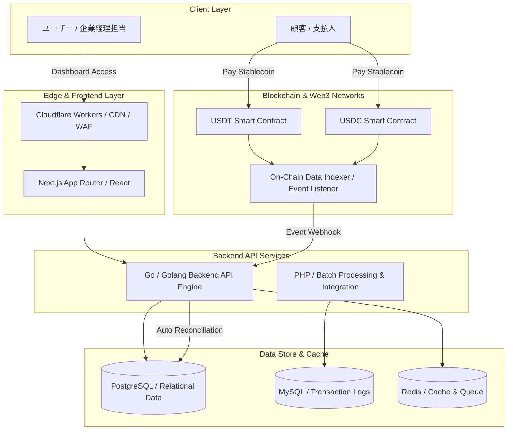
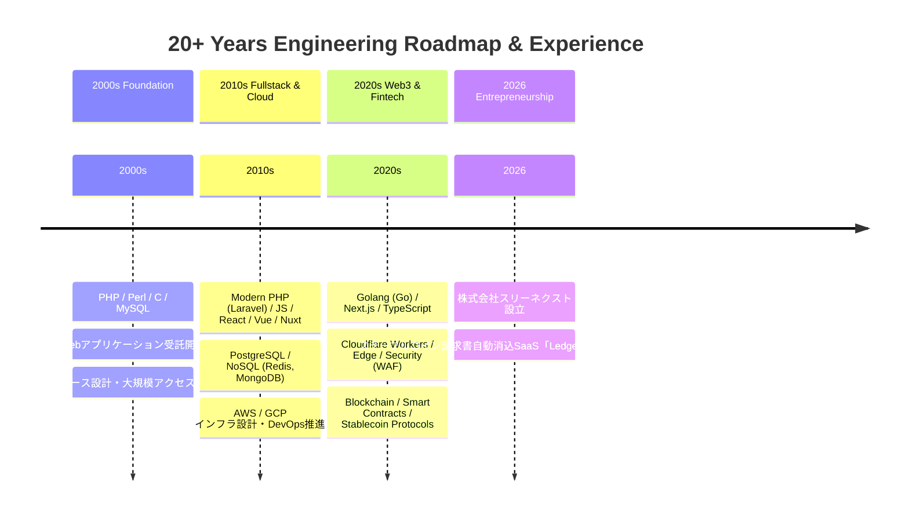
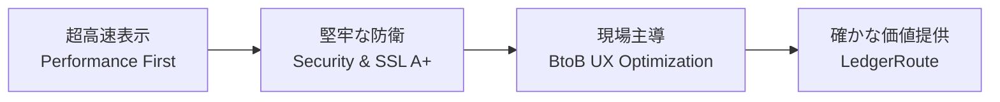

# Hi there, I'm Yoshitsugu Seki (関 良嗣) 👋

  
  
  

---

## 🚀 About Me

株式会社スリーネクスト（Three Next Co., Ltd.）代表取締役 兼 フルスタックエンジニアの **関 良嗣（Yoshitsugu Seki）** です。

20年以上にわたり、Webシステムのバックエンド開発、フロントエンド構築、データベース設計、インフラ・セキュリティ運用の現場第一線でコードを書き続けてきました。

現在は、Web3 / Fintech領域における現場のリアルな課題を解決するため、**ステーブルコイン請求書自動消込SaaS「LedgerRoute（レジャールート）」** を自社開発・運営しています。企画・設計・実装からクラウド/エッジインフラの構築まで、すべての工程を自ら牽引しています。

---

## 💡 What I'm Working On

### 1. 🚀 ステーブルコイン請求書自動消込SaaS「LedgerRoute」
企業間取引におけるステーブルコイン（USDT, USDC, DAI等）決済と、オンチェーンデータ・請求書の自動消込処理をシームレスにつなぐBtoB SaaSプロダクト。

* **課題**: ブロックチェーン上の送金データと会計・請求データの消込手作業によるコストとミスの発生
* **ソリューション**: オンチェーンイベントの自動検知、スマートコントラクト連携、請求データとの突き合わせ・会計システム連携の自動化

### 2. 🛡️ IT/DXコンサルティング & システム受託開発
長年培ったアーキテクチャ設計・パフォーマンス最適化・セキュリティの知見を活かし、企業のWeb3実装やDX支援、技術顧問を行っています。

---

## 🏗️ LedgerRoute System Architecture

`LedgerRoute`のアーキテクチャおよび決済・消込処理フローの概要図です。

---

## 📈 My 20+ Years Tech Journey

これまでのエンジニアとしてのキャリアと技術スタックの変遷です。

---

## 🛠️ Tech Stack & Core Competencies

エンジニアとして20年間磨き上げてきた、実務で深く使いこなせる主要技術スタックです。

### 💻 Languages & Frameworks

* **Backend**: Golang (Go), PHP (Laravel / Native)
* **Frontend**: TypeScript, JavaScript, Next.js, React, Vue.js, Nuxt.js
* **Markup & Style**: HTML5, CSS3, Tailwind CSS, Sass

### 🗄️ Databases & Caching

* **Relational DB**: MySQL, PostgreSQL
* **NoSQL / In-Memory**: Redis, MongoDB, DynamoDB
* **NewSQL**:  

### ☁️ Cloud, Edge & Infrastructure

* **Cloud Providers**: AWS (EC2, S3, RDS, Lambda, ECS, CloudFront), GCP (Compute Engine, Cloud Run, BigQuery)
* **Edge & CDN**: Cloudflare (Workers, Pages, DNS, WAF, Turnstile, SSL/TLS)
* **DevOps & Containers**: Docker, CI/CD (GitHub Actions), Nginx, Linux Server Administration

### 🔗 Web3 & Security

* **Web3 / Fintech**: Ethereum / EVM Compatible Chains, Smart Contracts, ERC-20 (USDT/USDC/DAI), Web3.js / Ethers.js / Viem
* **Security & Network**: SSL/TLS Certificate Hardening (A+ Grade), DNSSEC, Core Web Vitals Optimization

---

## ⚡ Development & Architecture Philosophy

自社プロダクトおよび受託開発において徹底している3つの開発思想です。

1. **Performance First**: モバイル・デスクトップ問わず、表示速度・レスポンス速度を極限まで最適化
2. **Security & Reliability**: SSL/TLS A+ 評価、WAF、DNSSECの徹底によるゼロトラストに近い堅牢性確保
3. **BtoB UX Optimization**: 複雑なWeb3のデータ処理を、経理・財務現場が迷わず使えるシンプルなUIへ昇華

---

## 📫 Connect with Me

* **Corporate Site**: [https://www.threenext.com/](https://www.threenext.com/)
* **X (Twitter)**: [@yoshis2](https://www.google.com/url?sa=E&source=gmail&q=https://x.com/yoshis2)
* **LinkedIn**: [Yoshitsugu Seki](https://www.linkedin.com/)
* **Lit.link**: [lit.link/yoshis2](https://www.google.com/url?sa=E&source=gmail&q=https://lit.link/yoshis2)
* **Company**: 株式会社スリーネクスト（東京都港区六本木3-16-12 六本木KSビル5F）

---